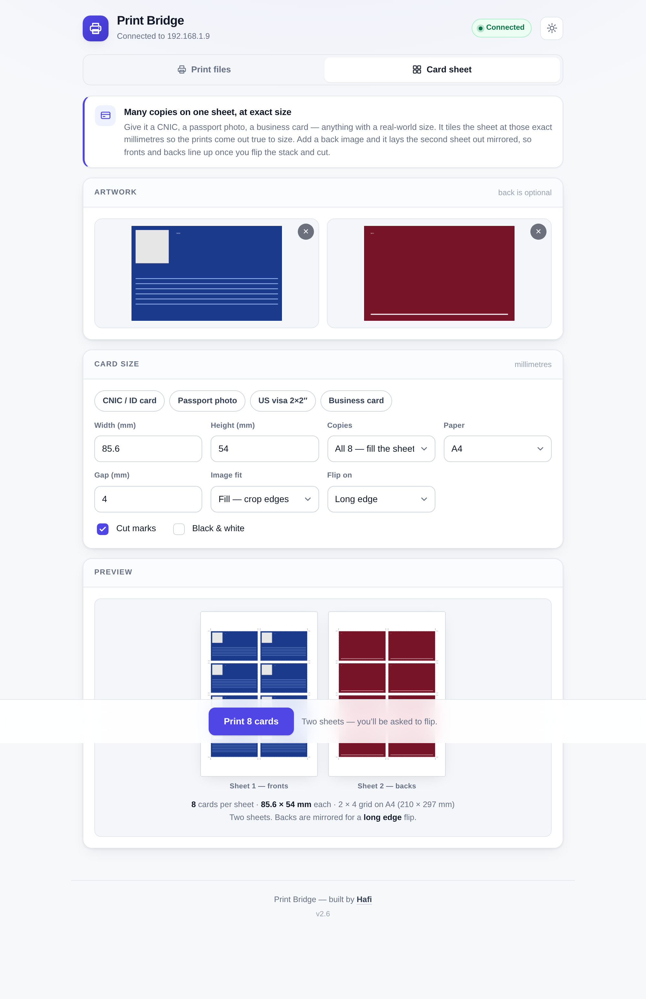
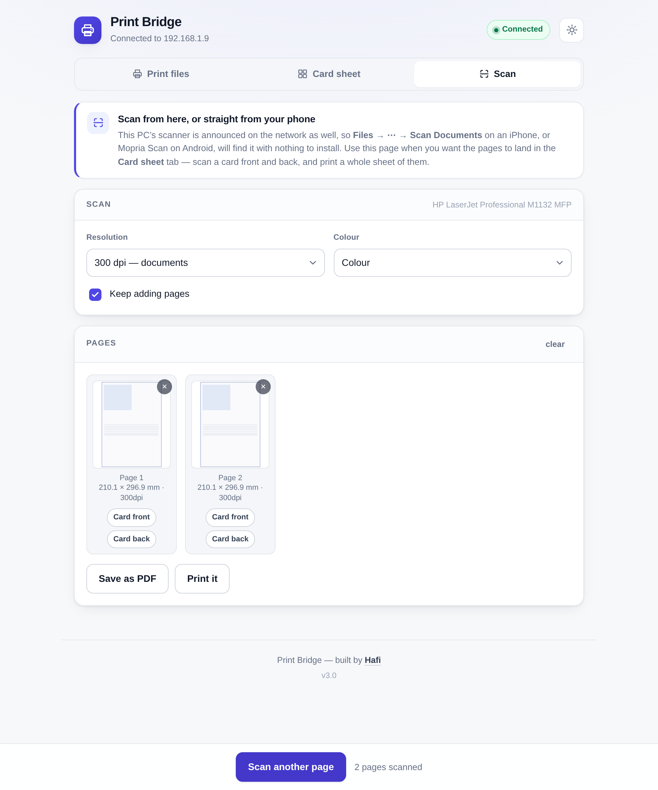
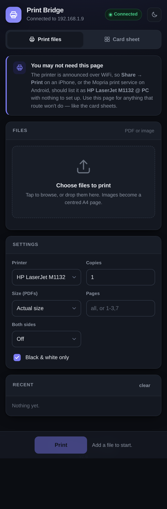
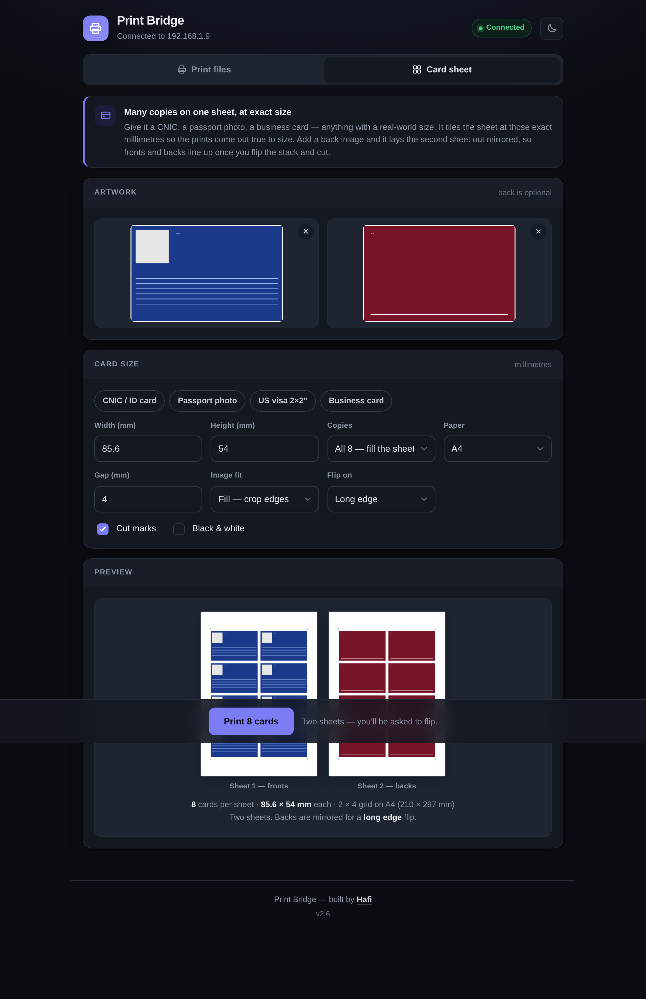
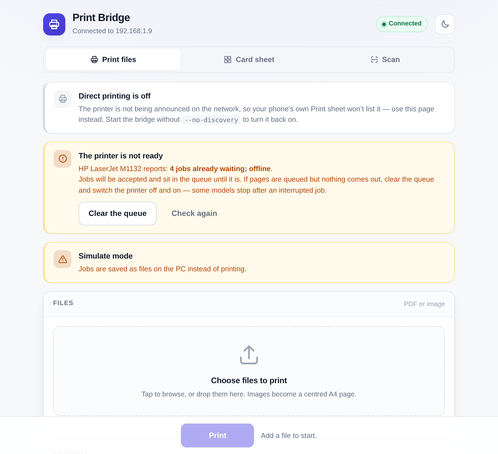

<div align="center">

# Print Bridge

**Share a USB printer — and its scanner — with every phone and laptop in the house.**

No new hardware. No cloud. No app on the phone.

[](https://github.com/hafeee44-lab/PrintBridge/actions/workflows/build.yml)
[](LICENSE)
[](https://www.python.org/)
[](#requirements)

</div>

---

Plenty of printers still sold today speak nothing but USB, and the cheap ones
cannot rasterise a page on their own — the PC does that and sends pixels down
the cable. That makes them invisible to AirPrint, to Mopria, and to every
"just print from your phone" feature of the last decade.

Print Bridge puts the PC in the middle. It answers the protocols phones
already speak, renders each job itself, and hands the result to the printer
driver that is already installed.

```
   iPhone · Android · Mac · laptop
                 │
                 │   Wi-Fi — IPP + Bonjour  (printing)
                 │           eSCL + Bonjour (scanning)
                 ▼
        ┌──────────────────────┐
        │   Windows PC         │
        │   Print Bridge       │
        │   ├ PDFium  renders  │
        │   └ GDI     prints   │
        └──────────┬───────────┘
                   │  USB
                   ▼
        host-based printer / MFP
```

## What you get

| | |
|---|---|
| **Print from anything** | Share → Print on an iPhone, Mopria on Android, or Add Printer on a laptop. The printer appears on its own. |
| **Scan to anything** | Files → Scan Documents on iOS, Mopria Scan on Android. Put a page on the glass, tap, get a PDF. |
| **Card sheets** | Tile a CNIC, passport photo or business card at exact millimetre sizes, with cut marks. Add a back image and it lays out a mirrored second sheet so both sides line up after the flip. |
| **True physical size** | A page laid out at 210 × 297 mm measures 210 × 297 mm on paper. The bridge knows the printer's resolution and the margin it cannot reach. |
| **Nothing else to install** | PDFium renders, Windows prints. No Acrobat, no SumatraPDF, no vendor software. |
| **Stays out of the way** | Starts at logon, lives in the tray. Or build it as one `.exe` and double-click it. |

<div align="center">


<br>
<sub>Card sheets with mirrored backs · scanning straight into the card composer</sub>
</div>

## Quick start

1. Plug the printer in and make sure **Windows itself** can print to it — install
   the driver and print a Windows test page first. Print Bridge shares printers
   Windows already has; it does not replace a driver.
2. Download this repository (or grab the `.exe` from
   [Releases](https://github.com/hafeee44-lab/PrintBridge/releases)).
3. Double-click **`Start Print Bridge.bat`**. It finds or installs Python, fetches
   the PDF engine, opens the firewall ports, and starts.
4. On your phone: **Share → Print**. The printer is there.

Leave the window open, or run **`Install Autostart.bat`** once and it starts at
every logon with no window at all.

<div align="center">


<br>
<sub>The same page on a phone and on a laptop — light or dark, your choice</sub>
</div>

### Check it works

```
Start Print Bridge.bat --test-page
```

Prints one page: a border 10 mm from every edge, a 100 mm square in the middle,
ticks every 10 mm. Hold a ruler against it and you know the whole chain is right.

## How it prints

Most bridges of this kind shell out to another PDF application. This one does
the work itself, which is what makes the rest possible:

- **[PDFium](https://pdfium.googlesource.com/pdfium/)** — the engine inside
  Chrome — rasterises each page at the printer's own resolution.
- The bitmap goes straight to a printer device context through **GDI**, placed
  against the sheet rather than against whatever the driver felt like.
- Pages are handed over with **zero copies**: an A4 page at 600 dpi is 139 MB,
  and copying that per sheet is the difference between working and thrashing
  on an old machine.

Owning that step buys exact sizing, the duplex edge the client actually asked
for, and reverse page order in a single job.

If PDFium is missing the bridge falls back to SumatraPDF, and failing that to
whatever owns the PrintTo verb. The banner always says which is live.

## When the printer will not print

Some printers stop drawing jobs down after an interrupted one. Everything
after that queues up and nothing comes out — which looks like a bug here and
is not. Print Bridge asks the spooler and tells you:

<div align="center">

</div>

**Clear the queue** cancels everything waiting and takes the printer off pause.
There is a matching item in the tray menu, and `--clear-queue` from a console.

## Options

| Argument | Effect |
|---|---|
| `--printer "NAME"` | Share a specific printer. Repeat for several. |
| `--all-printers` | Share every printer installed on this PC |
| `--name "Study printer"` | The name phones will show |
| `--pin 1234` | Require a code before anything prints or scans |
| `--test-page` | Print one measurable page and exit |
| `--clear-queue` | Cancel everything waiting, un-pause, exit |
| `--debug-print` | Log what the driver is told and what it answers |
| `--no-scanner` | Do not offer the scanner |
| `--simulate` | Print nothing; save each job to a file |
| `--list` | List printers with port, driver and tags, then exit |

The [full manual](docs/manual.md) covers the rest, including two-sided
printing, quality settings and troubleshooting.

## Requirements

- Windows 7 or later. One codebase — older Windows is handled by fallbacks,
  not a separate build. The [`win7/`](win7) folder holds a launcher that
  installs the last Python that runs there.
- Python 3.8 or later, installed by the launcher if missing.
- `pypdfium2` and `zeroconf`, also installed by the launcher.
- A printer with a working Windows driver.

## Building the single .exe

```
Build EXE.bat
```

Produces `dist\Print Bridge.exe` — one file containing Python, the PDF engine
and the web page. CI builds the same thing on every push and attaches it to
tagged releases.

## Tests

```
python -m unittest discover -s tests
```

57 tests, and they run on any platform: everything Windows-only is behind a
guard that declines rather than failing. They cover page placement in every
scaling mode, the card-sheet geometry, PDF and JPEG writing, the eSCL
protocol, and a rule that every ctypes call declares its argument types —
which exists because forgetting once cost a day.

## Contributing

Bug reports from printers I cannot test against are especially welcome.
See [CONTRIBUTING.md](CONTRIBUTING.md) for how to report one and how the code
is laid out, [SECURITY.md](SECURITY.md) for what this exposes on your network,
and [CODE_OF_CONDUCT.md](CODE_OF_CONDUCT.md) for the house rules.

## Licence

MIT — see [LICENSE](LICENSE).

Built by **Hafi** — [@hafeee44-lab](https://github.com/hafeee44-lab).

Standing on [PDFium](https://pdfium.googlesource.com/pdfium/) (BSD/Apache) via
[pypdfium2](https://github.com/pypdfium2-team/pypdfium2),
[python-zeroconf](https://github.com/python-zeroconf/python-zeroconf), and
[SumatraPDF](https://www.sumatrapdfreader.org/) as an optional fallback.
